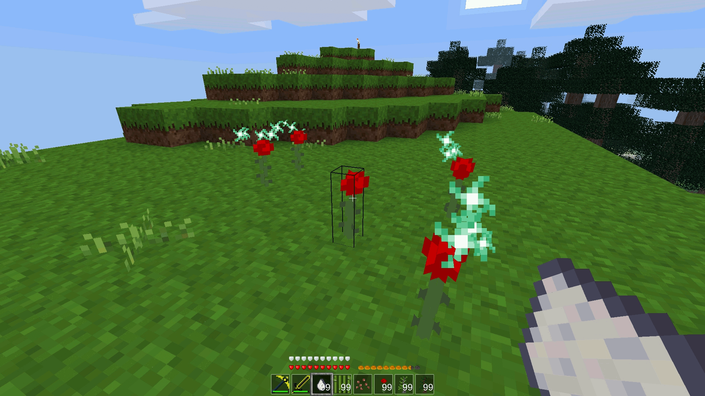

# Bonemeal by SaKeL [bonemeal]
Mod for Minetest. It provides one kind of simple bone meal (fertilizer) for fast growing plants, flowers, saplings, papyrus, grass...

Based on default minetest_game API with as less additions as possible what makes this mod super light-weight and suitable for online multiplayer servers.

Supports default minetest game blocks/plants/flowers... and any mod what uses minetest game API, e.g. farming_additions - though other mods can be easily implemented too.

This mod aims to be simple, light-weight and fast, therefore it will have no bone meal 'strength', multiple types of bone meals nor diamond/mese bone meal.

## Description
Current functionality based on what you use the bone meal.

### Blocks
**Dirt with grass:** Grass and jungle grass will form on randomly-selected adjacent grass blocks (`default:dirt_with_grass`) up to 5 blocks away.

**Dirt with dry grass:** Dry grass will form on randomly-selected adjacent dry grass blocks (`default:dirt_with_dry_grass`) up to 5 blocks away.

**Sand (group sand) and dirt with snow:** Dry shrub will form on randomly-selected adjacent sand or dirt with snow blocks (`group = {sand = 1}` or `default:dirt_with_snow`) up to 5 blocks away.

### Flowers, mushrooms and waterlily
Targeted flower/mushroom/waterlily will form on randomly-selected adjacent grass or water source blocks (`default:dirt_with_grass` or `default:water_source`) up to 5 blocks away.

### Farming and farming addons
Targeted plant will randomly grow on wet soil blocks (`group = {soil = 3}`).

**Farming addons**
Bone meal only affects the stem itself, it will not cause melons or pumpkins to sprout from a mature stem.

### Saplings
Trees and bushes have 50% chance to grow to a mature tree. A tree will not grow if the sapling is not planted in proper ground/soil (`group = {soil = 0}`).

### Papyrus
Papyrus have 50% chance to grow to a next stage. Bone meal has to be applied to the lowes block of the papyrus plant. Papyrus will not grow if is not planted in proper ground (`default:dirt_with_grass`, `default:dirt` next to the water up to 3 blocks).

### Recipe
**Bones** or **coral skeleton** block can be crafted to 9 bone meals.

## Dependencies
- default
- farming
- bones
- flowers

## Supported mods
- [bakedclay](https://forum.minetest.net/viewtopic.php?id=8890) flowers

## License:

### Code
GNU LGPL 2.1 (see included LICENSE file)

### Textures
- bonemeal_particle.png CC BY-SA 4.0, Pixel Perfection by XSSheep
- bonemeal_bonemeal.png GNU LGPL 2.1, by SaKeL

### Sounds
- bonemeal_grow.ogg CC BY 3.0, https://freesound.org/people/MaxDemianAGL/sounds/131050

## Installation
see: http://wiki.minetest.com/wiki/Installing_Mods
