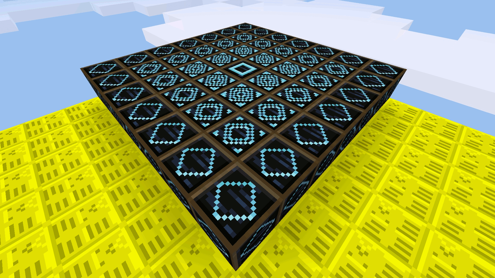

Telemosaic by SaKeL [telemosaic]
=======================

A Minetest mod for user-generated teleportation pads.

Fork from: https://github.com/bendeutsch/minetest-telemosaic

Rewritten from scratch by SaKeL

License:
  Code: LGPL 2.1 (see included LICENSE file)
  Textures: CC-BY-SA (see http://creativecommons.org/licenses/by-sa/4.0/)

Report bugs or request help on the forum topic.

Description
-----------

This is a mod for MineTest. It provides teleportation pads, called"beacons". The menus and GUIs are included, you set the destination with a simple "key" item. There is GUI for the destination but you can also use signs.

Another difference is the limited default range of the beacons. By default the beacons have no range. To increase the range, you need to place "extenders" around the beacon. The extenders come in different tiers, allowing the extenders to form a pretty pattern; hence the name "telemosaic".

Current behavior
----------------

Beacons are created with 2 diamonds, 3 obsidian blocks, and a wooden door: first row diamond, door, diamond; second row the obsidian blocks.

Right-clicking a beacon with a default mese crystal fragment remembers the position in the fragment, which turns into a telemosaic key. Right-clicking a second beacon with the key sets up a teleportation route from the first beacon to the second beacon. To set up a return path, right-click the second beacon with the fragment, and the first beacon with the resulting key again.

The beacons do not need to be strictly paired this way: rings or star-shaped networks are also possible. Each beacon has only a single destination, but can itself be the destination of several others.

Beacons will check that their destination is sane: the destinations two nodes above it should be clear for walking / standing in. If your Minetest version supports it, the beacon will emerge the area prior to checking and teleporting. Emerging is merely a convenience, though.

If the beacon destination is too far away, the beacon will let you know in chat message how many nodes you are passed from the departure power/range. To extend the range for a beacon, place "extenders" next to it, within a 7x7 horizontal square centered on the beacon. The extenders have to have air/empty space above them otherwise they will not function.

Extenders come in three tiers: tier 1 extends all affected beacons by 10 nodes, tier 2 by 30 nodes, and tier 3 by 90 nodes. Placing or digging extenders will update affected beacons.

Tier 1 extenders are crafted by placing an obsidian block, a wooden door, and another obsidian block in a horizontal row with a diamond above the door in first row. Tier 2 extenders are crafted with an obsidian block in the middle, surrounded by a cross of four tier 1 extenders. Tier 3 extenders are crafted with an obsidian block surrounded by four tier 2 extenders.

Protected beacons cannot be configured nor teleported from. You have to protect your beacons and extenders, by default they are not protected.

- beacons have no power by default - you need to use extenders to get some range
- destination beacon can be without the power (if it's destination) - to teleport somewhere you need power / extenders
- no dye coloring but new Minetest like textures (with light in dark based on the tier)
- protected beacons cannot be configured nor teleport from
- GUI, formspecs and info tooltips included due to complexity of the travel net - very helpful
- telemosaic key will not turn in to mese shard when destination too far - instead it will let you know how many blocks you are too far, you can move it closer and use the telemosaic key again
- recipe for extender tier 1 needs diamond
- extenders ranges are 10, 30 90 (tier 1, 2, 3) - there are no settings for changing this atm
- when teleport in progress you can't move for 5 seconds else teleport will be cancelled (idea from warps)
- extenders need to have a free block of space / air above them else they will not work
- you can add names and/or rename destinations
- after adding new name or removing beacons all destinations are updated respectively
- adding or removing extenders will updated all beacons in range respectively

Future plans
------------

* When beacon have maximum power/range add field for item with which other players can pay to use the teleporter
* Implement shared protection from protector redo mod (or other mods)

Dependencies
------------

* default
* doors

Installation
------------

see: http://wiki.minetest.com/wiki/Installing_Mods
